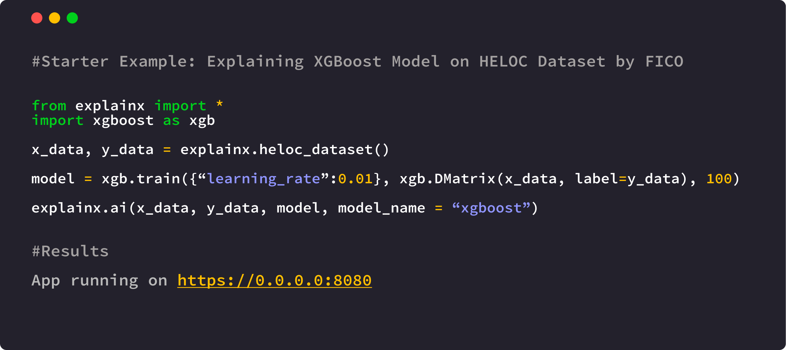

<h1 align="center">
	 
	<br>
</h1>

<p align="center">
  <a href="https://www.python.org/downloads/"></a>
  <!-- <a href="https://pypi.org/project/explainx/"></a> -->
  <!-- <a href="https://pypi.org/project/explainx/"></a> -->
  <a href="https://www.explainx.ai/"> </a>
</p>

ExplainX.ai is a fast, scalable and end-to-end Explainable AI framework for data scientists & machine learning engineers. 

Understand overall model behavior, get the reasoning behind model predictions, remove biases and create convincing explanations for your business stakeholders with explainX. [](https://twitter.com/intent/tweet?text=Explain%20any%20black-box%20Machine%20Learning%20model%20in%20just%20one%20line%20of%20code%21&url=https://www.explainx.ai&hashtags=xai,explainable_ai,explainable_machine_learning,trust_in_ai,transparent_ai)



#### Why we need explainability & interpretibility?

Essential for:
1. Model debugging - Why did my model make a mistake? 
2. Detecting fairness issues - Is my model biased? If yes, where?
3. Human-AI cooperation - How can I understand and trust the model's decisions?
4. Regulatory compliance - Does my model satisfy legal & regulatory requirements?
5. High-risk applications - Healthcare, Financial Services, FinTech, Judicial, Security etc,.

Visit our website to learn more: https://www.explainx.ai     

## Try it out

* [Installing explainX](https://docs.explainx.ai/getting-started/installation)
* [Working Examples](https://docs.explainx.ai/getting-started/starter-example)
* [explainX Dashboard Features](https://docs.explainx.ai/tutorials/analyzing-dashboard)
* [Documentation](https://docs.explainx.ai/)
* [Help Us Improve explainX.ai](https://forms.gle/5Q1xaHd7s6UQkRzf8)


# Installation

Python 3.5+ | Linux, Mac, Windows (Install [Microsoft C++ Build Tools](https://visualstudio.microsoft.com/visual-cpp-build-tools/) first to run on Windows.)

```sh
pip install explainx
```

## Installation on the cloud
If you are using AWS SageMaker of Jupyter Notebook deployed on the cloud, visit our documentation for step-by-step guide installing and running explainX. [Cloud Installation Instructions](https://docs.explainx.ai/getting-started/installation)


## Example Usage
After successfully installing explainX, open up your Python IDE of Jupyter Notebook and simply follow the code below to use it:

1. Import required module.

```python
from explainx import * 
from sklearn.ensemble import RandomForestClassifier
from sklearn.model_selection import train_test_split

```

2. Load and split your dataset into x_data and y_data

```python
#Load Dataset: X_Data, Y_Data 
#X_Data = Pandas DataFrame
#Y_Data = Numpy Array or List

X_data,Y_data = explainx.dataset_heloc()
```

3. Split dataset into training & testing. 

``` python
X_train, X_test, Y_train, Y_test = train_test_split(X_data,Y_data, test_size=0.3, random_state=0)
```

4. Train your model.

```python
# Train a RandomForest Model
model = RandomForestClassifier()
model.fit(X_train, Y_train)
```

5. Pass your model and dataset into the explainX function:

```python
explainx.ai(X_test, Y_test, model, model_name="randomforest")
```

6. Click on the dashboard link to start exploring model behavior:

```python
App running on https://0.0.0.0:8080
```

**If you are running explainX on the cloud e.g., AWS Sagemaker?** **https://0.0.0.0:8080** will not work.
Please visit our documentation for installation instructions for the cloud: [Cloud Installation Instructions](https://docs.explainx.ai/getting-started/installation)

After installation is complete, just open your **terminal** and run the following command.
```jupyter
lt -h "https://serverless.social" -p [port number]
```
```jupyter
lt -h "https://serverless.social" -p 8080
```


Learn to analyze the dashboard by following this link: [explainX Dashboard Features](https://explainx-documentation.netlify.app/analyze-dashboard/)

Visit the documentation to [learn more](https://docs.explainx.ai/)

## Models Supported
1. Catboost
2. xgboost==1.0.2
3. Gradient Boosting Regressor
4. RandomForest Model
5. SVM
6. KNeighboursClassifier
7. Logistic Regression
8. DecisionTreeClassifier
9. Scikit-learn Models
10. Neural Networks

## Walkthough Video Tutorial

Please click on the image below to load the tutorial:

[](https://youtu.be/X3fk-r2G15k)  

(Note: Please manually set it to 720p or greater to have the text appear clearly)

## Contributing
Pull requests are welcome. In order to make changes to explainx, the ideal approach is to fork the repository then clone the fork locally.

For major changes, please open an issue first to discuss what you would like to change.
Please make sure to update tests as appropriate.

## Report Issues

Please help us by [reporting any issues](https://github.com/explainX/explainx/issues/new) you may have while using explainX.

## License
[MIT](https://choosealicense.com/licenses/mit/)
