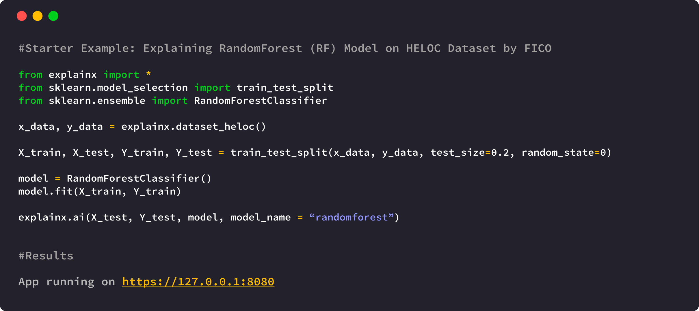

# explainX: Explainable AI Framework for Data Scientists


#### ExplainX is a model explainability/interpretability framework for data scientists and business users.

[](https://pypi.org/project/explainx/)
[](https://pepy.tech/project/dalex)

[](https://www.explainx.ai/)


Use explainX to understand overall model behavior, explain the "why" behind model predictions, remove biases and create convincing explanations for your business stakeholders. [](https://twitter.com/intent/tweet?text=Explain%20any%20black-box%20Machine%20Learning%20model%20in%20just%20one%20line%20of%20code%21&url=https://www.explainx.ai&hashtags=xai,explainable_ai,explainable_machine_learning,trust_in_ai,transparent_ai)




#### Why we need model explainability & interpretibility?

Essential for:
1. Explaining model predictions
2. Debugging models
3. Detecting biases in data
4. Gaining trust of business users
5. Successfully deploying AI solution

#### What questions can we answer with explainX?

1. Why did my model make a mistake? 
2. Is my model biased? If yes, where?
3. How can I understand and trust the model's decisions?
4. Does my model satisfy legal & regulatory requirements?

Visit our website to learn more: https://www.explainx.ai     

# Get Started

## Installation

Python 3.5+ | Linux, Mac, Windows

```sh
pip install explainx
```

To download on Windows, please install [Microsoft C++ Build Tools](https://visualstudio.microsoft.com/visual-cpp-build-tools/) first and then install the explainX package via ``` pip ```

## Installation on the cloud
If you are using a notebook instance on the cloud (AWS SageMaker, Colab, Azure), please follow our step-by-step guide to install & run explainX cloud. 
[Cloud Installation Instructions](https://docs.explainx.ai/getting-started/installation)


## Usage (Example)
After successfully installing explainX, open up your Python IDE of Jupyter Notebook and simply follow the code below to use it:

1. Import required module.

```python
from explainx import * 
from sklearn.ensemble import RandomForestClassifier
from sklearn.model_selection import train_test_split
```

2. Load and split your dataset into x_data and y_data

```python
#Load Dataset: X_Data, Y_Data 
#X_Data = Pandas DataFrame
#Y_Data = Numpy Array or List

X_data,Y_data = explainx.dataset_heloc()
```

3. Split dataset into training & testing. 

``` python
X_train, X_test, Y_train, Y_test = train_test_split(X_data,Y_data, test_size=0.3, random_state=0)
```

4. Train your model.

```python
# Train a RandomForest Model
model = RandomForestClassifier()
model.fit(X_train, Y_train)
```

5. Pass your model and dataset into the explainX function:

```python
explainx.ai(X_test, Y_test, model, model_name="randomforest")
```

6. Click on the dashboard link to start exploring model behavior:

```python
App running on https://0.0.0.0:8080
```

**If you are running explainX on the cloud e.g., AWS Sagemaker?** **https://0.0.0.0:8080** will not work.
Please visit our documentation for installation instructions for the cloud: [Cloud Installation Instructions](https://docs.explainx.ai/getting-started/installation)

After installation is complete, just open your **terminal** and run the following command.
```jupyter
lt -h "https://serverless.social" -p [port number]
```
```jupyter
lt -h "https://serverless.social" -p 8080
```


## Walkthough Video Tutorial

Please click on the image below to load the tutorial:

[](https://youtu.be/CDMpOismME8)  

(Note: Please manually set it to 720p or greater to have the text appear clearly)

## Supported Techniques

|Interpretability Technique | Status |
|--|--|
|SHAP Kernel Explainer| Live |
|SHAP Tree Explainer| Live |
|What-if Analysis| Live |
|Model Performance Comparison | Live |
|Partial Dependence Plot| Live |
|Surrogate Decision Tree | Coming Soon |
|Anchors | Coming Soon |
|Integrated Gradients (IG)| Coming Soon |

## Main Models Supported

| No. | Model Name | Status |
|--|--|--|
|1. | Catboost | Live|
|2. | XGboost==1.0.2 | Live|
|3. | Gradient Boosting Regressor| Live|
|4. | RandomForest Model| Live|
|5. | SVM|Live|
|6. | KNeighboursClassifier| Live
|7. | Logistic Regression| Live |
|8. | DecisionTreeClassifier|Live |
|9. | All Scikit-learn Models|Live |
|10.| Neural Networks|Live |
|11.| H2O.ai AutoML | Next in Line |
|12.| TensorFlow Models | Coming Soon |
|13.| PyTorch Models | Coming Soon |


## Contributing
Pull requests are welcome. In order to make changes to explainx, the ideal approach is to fork the repository then clone the fork locally.

For major changes, please open an issue first to discuss what you would like to change.
Please make sure to update tests as appropriate.

## Report Issues

Please help us by [reporting any issues](https://github.com/explainX/explainx/issues/new) you may have while using explainX.

## License
[MIT](https://choosealicense.com/licenses/mit/)
